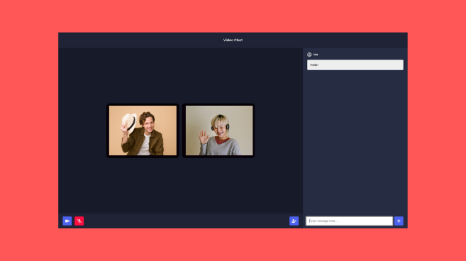

# Video-chat-v1

Video-chat-v1 is a video chat app that makes it easy to groups up with people you want to meet

Check out the live demo: https://video-chat-app-v1.herokuapp.com/

An article I wrote which explains how I build this: https://bit.ly/3wh0gyR

This app is build using NodeJS, Socket.io, and Peerjs(WebRTC)

## How to run the project?

1. Clone this repository in your local system.
2. Open the command prompt from your project directory and run the command `npm start`.
3. Go to your browser and type `http://127.0.0.1:5000/` in the address bar.
4. Hurray! That's it.

### ToDo

- [ ] - Recreate the Front-end with React.

